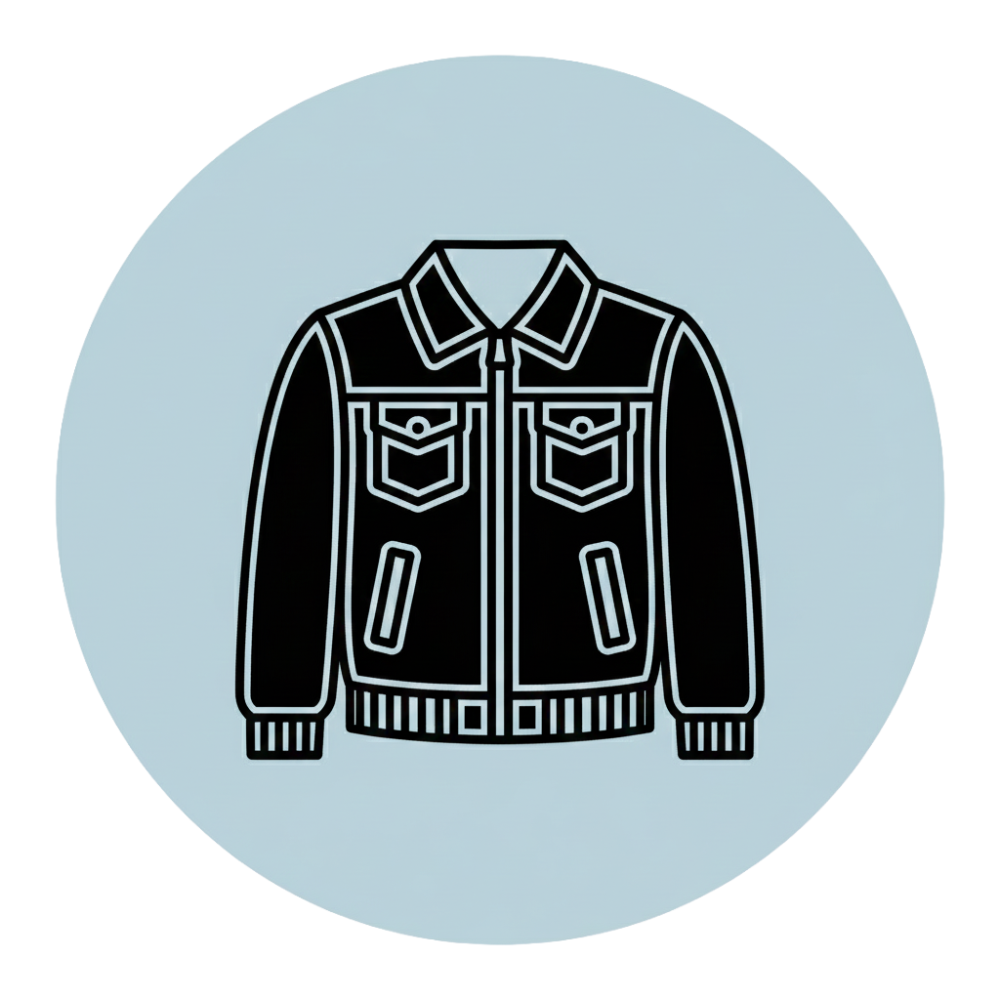

# _Outerwair_ - CS 160 Project
<table>
  <tr>
    <td>
      
    </td>
    <td>
      <strong>Team [E]ggcelent</strong><br>
      Connor Chow, Michael Liu, Elliott Chia, Han Yang
    </td>
  </tr>
</table>

---
## TO RUN:
__inside the root folder__:

1. run:
```
npm install
```
2. Create a `.env` file with a `VITE_GEMINI_API_KEY=<key>`

3. then run:
```
npm run dev
```
---

---
## Description

### Problem
Online shopping is becoming quite popular over in-person shopping due to it’s high convenience. However, this come with the drawback of not being able to try on clothing beforehand, and more difficult time deciding how to craft outfits. As a result, it’s more challenging for less-avid shoppers to craft outfits or spend less time returning clothes they ordered.

### Target User Group
Individuals who need to visualize how clothing items will look on them, such as online shoppers. It also serves users who frequently mix and match pieces to assemble specific outfits—like performers or cosplayers. This app supports creative freedom by making outfit visualization easy and intuitive.

### Solution
We created a web interface that enables users to be able to take a model, either uploaded or camera, and drag any photo of clothing/accessories which can be merged onto the model. Our solution uses the camera function to enable the user to easily try clothing on themselves, without requiring all the extra steps of uploading a photo of yourself to the website. We’ve added drag-and-drop functionality with auto-sorting to create a more seamless user experience. 

---

## React + Vite

This template provides a minimal setup to get React working in Vite with HMR and some ESLint rules.

Currently, two official plugins are available:

- [@vitejs/plugin-react](https://github.com/vitejs/vite-plugin-react/blob/main/packages/plugin-react) uses [Babel](https://babeljs.io/) (or [oxc](https://oxc.rs) when used in [rolldown-vite](https://vite.dev/guide/rolldown)) for Fast Refresh
- [@vitejs/plugin-react-swc](https://github.com/vitejs/vite-plugin-react/blob/main/packages/plugin-react-swc) uses [SWC](https://swc.rs/) for Fast Refresh

### React Compiler

The React Compiler is enabled on this template. See [this documentation](https://react.dev/learn/react-compiler) for more information.

Note: This will impact Vite dev & build performances.

### Expanding the ESLint configuration

If you are developing a production application, we recommend using TypeScript with type-aware lint rules enabled. Check out the [TS template](https://github.com/vitejs/vite/tree/main/packages/create-vite/template-react-ts) for information on how to integrate TypeScript and [`typescript-eslint`](https://typescript-eslint.io) in your project.
